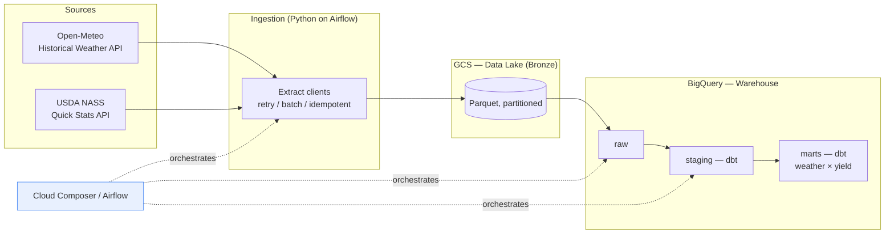

# weather-crop-yield-warehouse

A batch data pipeline and analytical data warehouse that correlates **historical
weather** with **US crop yields** (corn & soybeans) at county and state level, built
on **Google Cloud Platform** and orchestrated with **Apache Airflow (Cloud Composer)**.

> Portfolio project. The goal is a production-shaped, reproducible data platform that
> demonstrates modern data-engineering practices end to end: IaC, ELT, a medallion
> warehouse, data quality testing, orchestration, CI/CD, and cost/observability
> guardrails.

---

## What it does

Annual US crop yields are heavily driven by in-season weather (heat stress, drought,
growing-degree-day accumulation). This project ingests:

- **Weather** — daily historical reanalysis (ERA5) from the free
  [Open-Meteo Historical Weather API](https://open-meteo.com/en/docs/historical-weather-api).
- **Crop yields** — annual county/state yields from the
  [USDA NASS Quick Stats API](https://www.nass.usda.gov/developer/index.php).

…and models them into a BigQuery warehouse where growing-season weather features are
joined to crop yields per county-year, ready for analysis.

## Architecture

## Tech stack

| Layer | Choice |
|---|---|
| Cloud | Google Cloud Platform |
| Orchestration | Apache Airflow on Cloud Composer 2 |
| Data lake | Google Cloud Storage (bronze landing) |
| Warehouse | BigQuery (raw → staging → marts) |
| Transformation | dbt Core |
| Ingestion | Python 3.12 (`requests`/`httpx`, `pyarrow`) |
| Infrastructure | Terraform |
| Data quality | dbt tests (+ source freshness) |
| CI/CD | GitHub Actions |
| Tooling | `uv`, `ruff`, `sqlfluff`, `pre-commit`, `pytest` |

## Documentation

- 📋 **[docs/IMPLEMENTATION_PLAN.md](docs/IMPLEMENTATION_PLAN.md)** — the phased build
  guide (start here).
- 🔌 **[docs/DATA_SOURCES.md](docs/DATA_SOURCES.md)** — API reference for Open-Meteo &
  NASS (endpoints, params, auth, limits, sample requests).
- 🗄️ **[docs/DATA_MODEL.md](docs/DATA_MODEL.md)** — warehouse layers and table schemas.

## Roadmap (high level)

| Phase | Focus |
|---|---|
| 0 | Foundations & project scaffolding |
| 1 | Infrastructure as Code (Terraform) |
| 2 | Ingestion → bronze → raw |
| 3 | Transformation (dbt: staging → marts) |
| 4 | Orchestration (Airflow / Composer) |
| 5 | Data quality & testing |
| 6 | CI/CD (GitHub Actions) |
| 7 | Cost, monitoring & observability |
| 8 | Documentation & polish |

See the [implementation plan](docs/IMPLEMENTATION_PLAN.md) for details, deliverables,
and a definition of done per phase.

## License & data attribution

- Weather data © [Open-Meteo.com](https://open-meteo.com/) (CC BY 4.0), based on ERA5
  reanalysis (Copernicus Climate Change Service).
- Crop data: USDA National Agricultural Statistics Service, Quick Stats.
